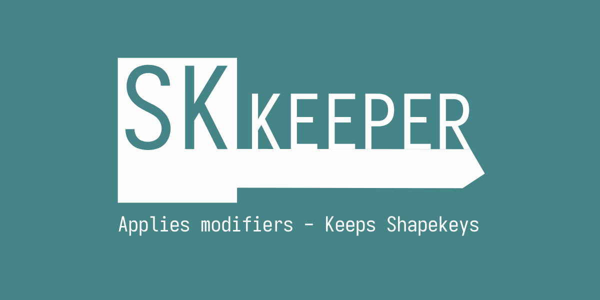
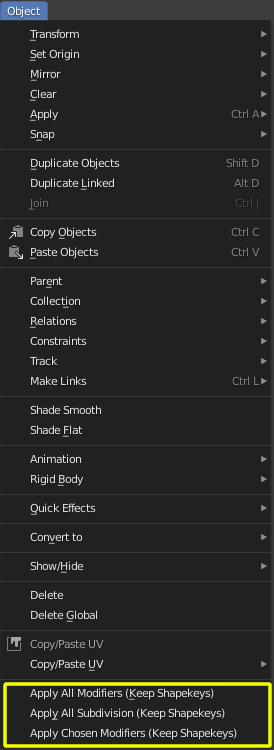
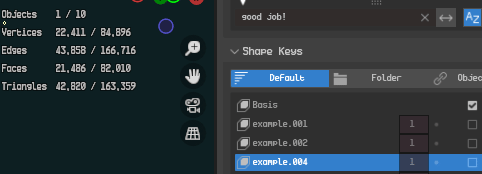

# Blender Addon - SKkeeper

 This Addon automates the process of trying to collapse down
modifiers on a mesh with shapekeys while keeping the shapekeys intact. This does not work with all modifiers due to
blender not having a reliable way of transfering shapekey information when vertex counts change in unpredictable ways
(e.g. Decimate, Weld modifiers)

## How to Install

Download the zipfile from the [Releases page](https://github.com/smokejohn/SKkeeper/releases) and install via Blenders
Addon-Preferences

Edit > Preferences > Add-ons > Install... > Select SKkeeper.zip

## How to Use

This Addon adds 3 new operators which can be found in the 3DViews Object Menu:

* **Sk: Apply All Modifiers (Keep Shapekeys)**
  * Applies all modifiers on the object
* **Sk: Apply Subdivision (Keep Shapekeys)**
  * Applies only the top most subdivision modifier and keeps the others
* **Sk: Apply Chosen Modifiers (Keep Shapekeys)**
  * Shows a popup with all modifiers on the object and only applies those you select
  * Might lead to unexpected behaviour if you choose to apply modifiers that aren't at the top of the modifier stack

Select the Object you want to apply modifiers to and select one of the options.

you can also search for the operators via the Quick Search floater (**Hotkey: F3**) and typing "shapekey" or other
keywords in the names of the operators.

## Troubleshooting Problems

### How this addon works

Here is a list of steps this addon does for you

1. Creates a copy of your working object and applies the modifiers depending on which operator your chose (Subdivision,
   Chosen Modifiers or All Modifiers)
   * This copy will be referred to as the **receiver** because it will be used to gather all shapekeys again
2. Creates a copy of your working object for each shapekey, uses that shapekey as base shape and applies the modifiers
depending on the chosen operator type
   * This copy will be referred to as a **donor** because it donates its shape as a shapekey to the receiver
3. Re-adds the donor for each shapekey to the receiver (using the blender operation "Join as Shapes")
   * **This step can fail, since blender only allows adding of meshes as shapekeys that have the same geometry as the
     base object**
4. Deletes your original working object and replaces it with the reciever

### Most often encountered problems

Now if the above mentioned **Step 3** fails for a specific shapekey the addon will cancel the operation and inform you
which shapekey could not be readded after the modifiers were applied.

If transferring of a shapekey fails the addon will stop and you can inspect the state during the last step
The scene will contain 2 new objects:
* sk\_receiver (the receiver)
* NameOfYourObject\_shapekey\_index (the problematic shapekey with modifier stack applied)

You can then use the **undo** command to return to your previous working state

#### The very first shapekey fails / all shapekeys fail

This is most likely because your modifier stack when collapsed always yields different geometry (vertex counts / edge
counts) each time. Here you need to work through your modifier stack and make sure when applied for different shapekeys
the vertex counts / edge counts are the same each time. Usual suspects for failing modifier stacks are:

* Decimate
* Weld (with very large merge thresholds)

#### A specific shapekey fails

Most often this case happens with a mirror / symmetry modifier where the blendshape moves vertices across the symmetry
line and then those vertices either get merged together or cut off leading to differing vertex counts between the
donor and the receiving object and thus the adding of the shapekey fails.

This can happen with other modifier combinations as well, so keep an eye open for potential cutting off, welding or
merging of vertices that could happen when the vertex positions change in your shapekey.

In some cases you can quickly check if your shapekey modifies vertex counts by raising its value to 1.0 and then
toggling them on and off. You should be able to see the vertex counts changing in the statistics overlay:

